# Adding Comments & Quick Comments to Power BI

## Decision points

1. We can have either 1 `dim_recipe_reviews` containing both comments & ratings. Or two separate tables. I like option 1 for the sake of keeping the schema simple.

2. Do we want to support anonymous comments? *(note: After talking with Stephen, we've decided to ignore anonymous comments for now.)* If so, we need to use the native `pim.dbo.recipes_rating.recipe_rating_id` instead of `concat(billing_agreement_id,recipe_id)`. This requires rerunning `fact_orders` but it's teh simpler long-term solution. We can also keep the composite key but use the native `recipe_rating_id` for anonymous comments, which avoid a re-run but it more convoluted.

3. Supporting anonymous comments also require either of:
    1. Having `fk_dim_recipe` in `dim_recipe_reviews` (easiest, but dim-dim joins go against star schema conventions).
    2. Having rows in `fact_orders` for review events (too big of a concept change IMO).
    3. Having a different table for anonymous reviews (simple, but makes it hard to see all reviews for one recipe).

4. Do we keep duplicates columns in `fact_orders` and `dim_recipe_reviews`? (e.g: `recipe_rating`.) This might cause confusion if we decide to support anonymous reviews without adding them as rows in `fact_orders`. Average rating from `fact_orders` wouldn't match average rating from `dim_recipe_reviews` which would contain anonymous reviews.

5. We can either include `quick_comment_combination` in the regular `recipe_comment` column along with a boolean flag `is_quick_comment` or keep them in separate columns. I like the former since it would be easier for an end user in PBI to filter out quick comments than to coalesce regular comments and quick comments.

## Proposed schema:

```mermaid
erDiagram
direction TB
FACT_ORDERS ||--o| DIM_RECIPE_REVIEWS: can_have
DIM_RECIPE_REVIEWS ||--o{ BRIDGE_RECIPE_QUICK_COMMENTS: can_have
BRIDGE_RECIPE_QUICK_COMMENTS }|--|| DIM_QUICK_COMMENTS: has_many


FACT_ORDERS {
    string fk_dim_recipe_reviews FK "added (hash of recipe_rating_id)"
    string fk_bridge_recipes_quick_comments FK "added (hash of recipe_rating_id for quick comments only)"
    string recipe_rating_id "switch to native recipe_rating_id"
    string recipe_comment_id "remove?"
    int recipe_rating "remove?"
    int recipe_rating_score "remove?"
    string recipe_comment "remove?"
}
DIM_RECIPE_REVIEWS {
    string pk_dim_recipe_reviews PK
    string fk_dim_recipes FK "optional support for anonymous reviews"
    date recipe_review_created
    timestamp recipe_review_created_at
    string recipe_rating_id
    string recipe_comment_id "remove? Redundant with recipe_rating_id"
    int recipe_rating
    int recipe_rating_score
    string recipe_comment
    string all_quick_comments_local
    string all_quick_comments_english
    int number_of_quick_comments
    bool is_quick_comments
    bool is_anonymous_review
    bool is_not_cooked_dish
}
BRIDGE_RECIPE_REVIEWS_QUICK_COMMENTS {
    string pk_bridge_quick_comments PK
    string fk_dim_quick_comments FK
}
DIM_QUICK_COMMENTS {
    string pk_dim_quick_comments PK
    string quick_comment_id 
    string company_id
    int quick_comment_language_id
    string quick_comment_language_name
    string quick_comment_text_local
    string quick_comment_text_english
    int number_of_stars
}
```

