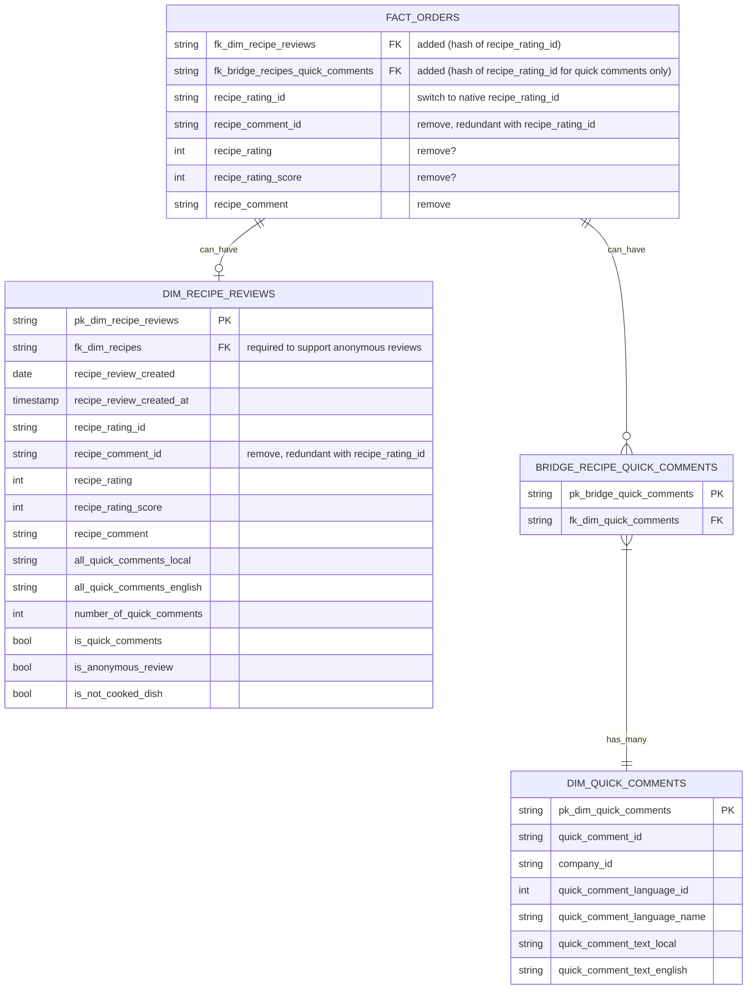

# Adding Comments & Quick Comments to Power BI

## Decision points

- We can have either 1 `dim_recipe_reviews` containing both comments & ratings. Or two separate tables. I like option 1 for the sake of keeping the schema simple.

- Do we want to support anonymous comments? If so, we need to use the native `pim.dbo.recipes_rating.recipe_rating_id` instead of `concat(billing_agreement_id,recipe_id)`. 

- Do we keep duplicates columns in `fact_orders` and `dim_recipe_reviews` (e.g: `recipe_rating`)? This might cause confusion if we decide to support anonymous reviews. Since ratings & comments without an `agreement_billing_id` cannot be in `fact_orders`.

- We can either include `quick_comment_combination` in the regular `recipe_comment` column along with a boolean flag `is_quick_comment` or keep them in separate columns. I like the former since it would be easier for an end user in PBI to filter out quick comments than to coalesce regular comments and quick comments.

## Proposed schema:

