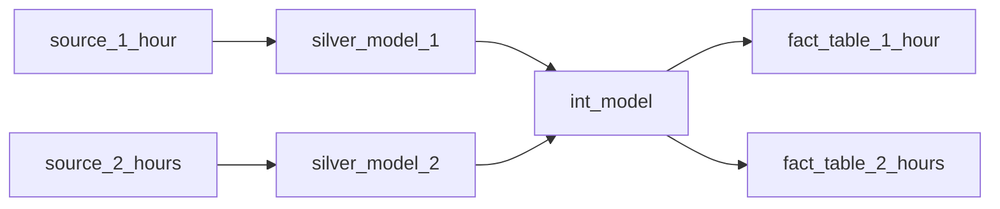
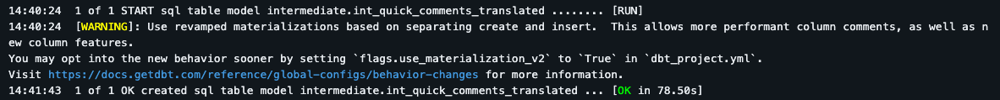
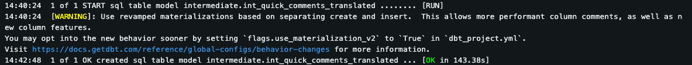
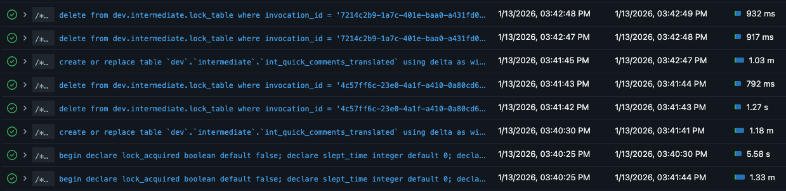

# Intro
This document serves as an ADR (Architecture Decision Record) and RFC (Request for Comments) regarding the implementation of multiple frequency jobs for dbt and a locking mechanism to prevent concurrency issues.
**Feedback/Comments requested**


# Goals
- Refresh some gold/diamond/mlgold dbt models at a sub-daily frequency (every hour, etc).
- Minimize the added cost of higher-frequency data.
- Reuse existing dbt models rather than create dedicated ones for higher-frequency data.
- Make changing the schedule of a dbt model as simple as possible. Do not require the creation of new pipelines.
- Refresh data "as fast as possible".


## Frequency tagging
How do we select a part of the dbt lineage to run at a specific frequency?
The best way we found is to use tags in dbt along with the selector intersection.

**1: Tag dbt sources.**

Add frequency tags to dbt sources. The tags should be consistent with the frequency set in the ingestion config.
Consider which tables contain data that actually changes often and should be ingested frequently.
It's ok to refresh a gold table even if some part of the data isn't up-to-date. Assume that the daily job will rerun everything
with the most up-to-date data available.

```yaml title="transform/silver/operations/_operations__source.yml"
sources:
  - name: operations
    schema: bronze
    description: "Tables from the operations database in the CoreDB Azure SQL Server"
    tables:
      - name: operations__case_category
      - name: operations__case_cause
      - name: operations__case_line
        tags: ["15_minutes"]
      - name: operations__case_line_type
      - name: operations__case_line_ingredient
        tags: ["15_minutes"]
      - name: operations__case_responsible
      - name: operations__cases
        tags: ["15_minutes"]
```
_Note 1: Having to tag the same table in the ingestion and in dbt sources is a bit annoying. Can possibly be automated._
_Note 2: The original plan was to tag silver models, but tagging sources is way more convenient and achieves the same thing._
_Note 3: Tagging sources also makes it easy to run snapshots at different frequencies._


**2: Tag dbt models at the end of the lineage**

We will also tag dbt models with the frequency that we want them to be refreshed at.
We only tag **leaf nodes**. Models at the end of the lineage (gold/diamond/mlgold) that we want to expose to downstream consumers.
Tagging silver or intermediate models is not necessary.

```yaml title="transform/models/gold/operations/_operations__models.yml"
  - name: fact_cases
    description: >
      Cases and case lines reltated to deliveries reported by the customer, customer service or partners.
      A case line includes communication records (SMS and notes), redelivery events, and complaints with reimbursement options.
      A delivery can only have one related case, but a case can have several case lines.
    latest_version: 1
    meta:
      owners:
        - "Marie Borg"
    config:
      alias: fact_cases
      tags: ["15_minutes"]
      contract:
        enforced: true
```

Silver and gold models should only ever have 1 frequency tag.

**3: Use intersection selector to handle everything in-between**

Now that we have tagged the start and the end of the lineage, we can use [dbt's intersection syntax](https://docs.getdbt.com/reference/node-selection/set-operators) to handle everything in-between.

In practice we run something like:
```bash
dbt run -s "tag:2_hours+,+tag:2_hours"
```

Which translates to "Run every model with the 2_hours tag and every model between two nodes with the 2_hours tag in the lineage".

In the example given so far, this will run:
- `fact_cases`
- The silver models depending on the tagged sources (`operations__case_lines`, `operations__case_line_ingredients` & `operations__cases`)
- All the intermediate models downstream of said silver models **AND** upstream of `fact_cases`

This method allows us to skip all the silver / intermediate models which have no new data ingested or aren't necessary for the gold table to be fresh.
This allows us to efficiently run parts of the whole dbt project at different frequencies without having to figure out the schedule of every intermediate model and tag them accordingly, which would be very painful.


## Concurrency headaches
dbt offers no guarantee when it comes to safe concurrency. Basically, having two different jobs that run the same dbt model at the same time is very likely to result in errors, or worse, data corruption.

This makes our life much more difficult because **some intermediate models may be used in several frequency jobs**. Consider the example below:




The `int_model` will be picked up by both `dbt run -s "tag:1_hours+,+tag:1_hours"` and `dbt run -s "tag:2_hours+,+tag:2_hours"`.
If we simply had 2 separate jobs running these dbt commands every hour and every 2 hours respectively, 
there would be a risk that they both try to run `int_model` at the same time. Leading to the kind of unpredictable concurrency issues that we want to avoid.

Silver and gold models aren't affected by this issue because they explicitly belong to a frequency job due to the tagging. That is, as long as the gold models/sources only have 1 frequency tag and there are no silver models dependent on multiple sources with conflicting tags.

**WARNING! Always have at least 1 day of lookback for incremental intermediate model.** If `int_model` in the example above had no lookback period, it would be run by the 1_hour job on stale data (silver_model_2 has not run yet) and the 2_hours job would not correct this because it would find that `int_model` is already up-to-date.


## Rejected solutions to concurrency issues
We've looked into many solutions to avoid concurrency issues. Most of those have been rejected because they have significant downsides or are insufficient to fix all concurrency issues by themselves. I still thought it was worth writing about those. First, to justify the solution we ended up going with. And second, because they are all valid ways to handle concurrency that could be useful in the future.


### 1. Make sure that all intermediate models explicitly belong to one and only one frequency job
This is the most common way to handle concurrency issues. However, it is also the most tedious. Basically requiring completely separate dbt models for each job that we have. This likely means a lot of refactoring, having different folders for different frequencies, explicitly figuring out the schedule of every int models and tagging them etc. It's also likely to result in some amount of code & data duplication. It's not a bad option, but it's a significant change in our architecture / way of working, so I wouldn't commit to it without a proper team discussion.


### 2. Use ephemeral materialization for all intermediate models
Ephemeral materialization doesn't create or modify a table or view for the model. The SQL of the ephemeral model simply gets interpolated in models referencing it as a CTE. This dodges all concurrency issues. However, it has a lot of downsides:
- Negates the performance upside of having shared transformations in intermediate models
- Intermediate models can no longer be queried
- The generated SQL becomes huge and very hard to debug
- Can't test or have data contracts on intermediate models

I think it's a good option for some cases. But it's too limiting to be our main resort IMO.


### 3. Running the shared workload first
Basically, instead of triggering the 1_hour job and the 2_hours job at 10:00AM, we would first have a job that runs the models shared between 1_hour and 2_hours. Then run the remaining models for each jobs. This is a straightforward and reliable solution, the problem is that the workloads of the different jobs are no longer independent. The 1_hour job would need some of the 2_hours model to run before it can start.

This solutions puts a lot of pressure on us to keep the shared job running fast enough to allow the highest frequency job to finish in time. So frequencies higher than 1 hour will be difficult to reach without refactoring some intermediate models to minimize overlap between jobs. It also means that adding some tables to the 2_hours job would have an impact on how long the 1_hour job takes to complete, which seems annoying to manage in the long run. 


### 4. Running the jobs in order + explicit exclusion
We could have every frequency job explicitly exclude every model that belongs to a faster job. Then run jobs in order of fastest to slowest.

For example, if we have a 1_hour job and a 2_hours job, the 2_hours job would run:
```bash
dbt run -s "tag:2_hours+,+tag:2_hours" --exclude "tag:1_hour+,+tag:1_hour"
```
We would then have a controller job that would run the 1_hour job every hour THEN the 2_hour job if the hour is even. 
Because the 2_hours job always run right after the 1_hour job, it can trust that all the models which would be shared with the 1_hour job have already been updated.

Unfortunately, this runs into an issue we've already discussed above:


In this example, the 1_hour job would ingest `source_1_hour` then run `silver_model_1` and `int_model`, it treats data from `source_2_hours` as static and unnecessary for updating fact_table_1_hour. 

The 2_hours job would then ingest data from `source_2_hours`, run `silver_model_2` and SKIP `int_model`, assuming that it's been refreshed by the 1_hour job. 

The result is that, `int_model` never gets refreshed with data from `source_2_hours`.

If we solve this issue by putting `source_2_hours` & `silver_model_2` on a 1 hour schedule, we've circled back to solution **3. Running the shared workload first**. If we split `int_model` into 2 models that only depend on `source_1_hour` and `source_2_hours` respectively, we're effectively using solution **1. Make sure that all intermediate models explicitly belong to one and only one frequency job**.

_But wait, how can we have concurrency issues if we run the jobs in order? The 1_hour job and the 2_hour job should never run at the same time?_ -> I made that mistake. The issue is that, unless we have a 1 hour time out for running the 1_hour & the 2_hours jobs, the next run of the 1_hour job might start while the 2_hours job is still running. If we have to force slow jobs to run in the same duration as fast jobs, might as well run everything at the highest frequency.


# Implementing locks for safe concurrency
The solution which appears to best solve concurrency issues in dbt to is to implement a locking mechanism. Locking is a common way to handle concurrency issues, but implementing it in dbt is not a common practice. I found a bunch of threads ([1](https://discourse.getdbt.com/t/dbt-concurrent-runs-and-the-need-for-locking/2560), [2](https://discourse.getdbt.com/t/concurrent-dbt-runs/11101/2), [3](https://www.reddit.com/r/dataengineering/comments/s9bfnu/dbt_question_about_running_multiple_schedules/)) about solving concurrency issues and there's an open [feature request](https://github.com/dbt-labs/dbt-core/issues/10858) for having locks in dbt-core. But nothing regarding an actual implementation of a locking mechanism.

All that to say, this isn't a time-tested solution. It has pros and cons that we'll discuss in more details later. But it's worth noting that this is a bit experimental and I'm completely willing to pivot to another option if there are some concerns.


## Desired behavior
We want to be able to run multiple dbt jobs at the same time without worrying about errors caused by two jobs trying to run the same model at once. This can be solved by implementing a locking mechanism at the model level. Basically:

- We have a lock table that serves as a shared state between otherwise isolated dbt invocations. A dbt invocation is a unique dbt command (e.g: a `dbt run` in a databricks task).
- Different dbt invocations can "communicate" with each other through the lock table.
- Before running an intermediate model, a dbt invocation will try to acquire a lock for that model. Acquiring a lock means inserting a row in the lock table that says "I'm running this model, no one else touch it".
- Once the model is done running, the dbt invocation will remove the lock by deleting the row it added to the lock table.
- If a dbt invocation tries to acquire a lock for a model, but sees that there is an existing lock from another dbt invocation, it will wait a bit before retrying.
- This effectively queues concurrent runs of the same dbt model by different dbt invocations. If a Databricks job (A) tries to run a dbt model while another job (B) is running it, job (A) will have to wait until job (B) is done running the model and releases the lock before proceeding.


## Implementation


### 1. Lock table and sleep function
First off, we need to a macro to create the lock table if it doesn't exist.
```sql title="transform/macros/locking/create_lock_table.sql"

create table if not exists {{ target.database }}.intermediate.lock_table(
    invocation_id string, -- unique ID of the dbt invocation
    model_name string, -- name of the model the invocation is trying to run
    acquired_at timestamp, -- timestamp at which the lock was acquired
    lock_valid_until timestamp -- expiration date of the lock (explained later)
);

```

Then a macro to create a custom sql_sleep() function. Since sleep() is not available in plain SQL.
```sql title="transform/macros/locking/create_function_sql_sleep.yml"

create function if not exists {{ target.database }}.intermediate.sql_sleep(seconds integer)
returns int
deterministic
language python
as $$
from time import sleep
sleep(seconds)
return seconds
$$;

```

We add these macros in `dbt_project.yml` under `on-run-start`. So they run before any dbt run.
Like all the macros we'll define for locking, these will not do anything unless you explicitly set a use_lock variable to true when calling `dbt run` or `dbt build`, e.g: `dbt run --vars '{"use_locks": "true"}'`. So locking is turned off by default. You may see calls to the macros in the log, but they won't do anything.

```yml title="transform/dbt_project.yml"
on-run-start: 
# all the lock macros only run if a use_lock: true var is explicitly passed to dbt-run
  - " {{ create_lock_table() }} "
  - " {{ create_function_sql_sleep() }} "
```

We have to use `create if not exists` instead of `create or replace` because the lock table needs to be persistent across dbt runs and because running several `create or replace` at the same tiem can raise concurrency errors. Unfortunately, this means that you need to manually drop the lock table and sql_sleep() function if you make code changes, otherwise, they won't be re-created with the new code.


### 2. Acquiring and releasing locks
We can now create a pre-hook that will try to acquire a lock before running a model and sleep before retrying if there is an existing lock. Unfortunately, dbt pre-hooks must be SQL. So SQL scripting is our only option to write the logic.

```sql title="transform/macros/locking/acquire_model_lock.sql"

begin
  declare lock_acquired boolean default false;
  declare sleep_increment integer default 15;
  declare lock_is_free boolean;

  while not lock_acquired do
    -- check if there already is a lock for the model we're trying to run
    set lock_is_free = (
      select count(*) = 0 
      from {{ target.database }}.intermediate.lock_table 
      where model_name = '{{ this }}'
    );
    
    -- if there is no existing lock
    if lock_is_free then
      -- insert a row to the lock table to register that this dbt invocation is currently running this model
      insert into {{ target.database }}.intermediate.lock_table 
      values ('{{ invocation_id }}', '{{ this }}', current_timestamp(), deadline);

    -- if there is an existing lock, sleep before retrying
    else
      select {{ target.database }}.intermediate.sql_sleep(sleep_increment);
    end if;
  end while;
end;

```

We also need a macro to release the lock we've put on a model once we're done running it.
```sql title="transform/macros/locking/release_model_lock.sql"

delete from {{ target.database }}.intermediate.lock_table
where invocation_id = '{{ invocation_id }}' and model_name = '{{ this }}';

```

These `acquire_model_lock()` and `release_model_lock()` macros will be respectively called as pre and post-hooks for all intermediate models.

_Note: `{{ this }}` (the name of the model) and `{{ invocation_id }}` are inherited automatically and need not be provided to the macros as arguments._
```yml title="transform/dbt_project.yml"
    intermediate:
      +schema: intermediate
      +materialized: table
      # pre and post hooks handle locking to avoid multiples dbt runs running the same int model at the same time
      +pre-hook: "
      
      {{ acquire_model_lock() }}
      "
      +post-hook: "
      
      {{ release_model_lock() }}
      "
```


### 3. Solving concurrency issues for the solution to concurrency issues
Unfortunately, this first version of `acquire_model_lock()` runs into a classic TOCTOU (Time-Of-Check to Time-Of-Use) race condition.
There is a small window between the point in time when we check whether there is a lock for a model and the time when we insert a row in the lock table. This gap leads to a situation where multiple dbt invocations can successfully acquire a lock for a model if they run `acquire_model_lock()` at the same time. 

This is the happy path:
```
1. dbt invocation (A) tries to acquire a lock
2. dbt invocation (A) checks the lock table -> it's free!
3. dbt invocation (A) inserts a lock
4. dbt invocation (B) tries to acquire a lock
5. dbt invocation (B) checks the lock table -> it's taken!
6. dbt invocation (B) waits before retrying
```

But if the timing is unlucky, this scenario is possible
```
1. dbt invocation (A) tries to acquire a lock
4. dbt invocation (B) tries to acquire a lock
2. dbt invocation (A) checks the lock table -> it's free!
5. dbt invocation (B) checks the lock table -> it's free!
3. dbt invocation (A) inserts a lock
6. dbt invocation (B) inserts a lock
```

This results in two dbt invocations running the same model at the same time, which is the very scenario we're trying to avoid.
The time window in which this issue can occur is quite small, a few seconds at most, but still unacceptable for production. We're bound to get unlucky at some point.

In order to handle these cases, we add post-insert validation. After inserting a lock to the lock table, a dbt invocation will check whether the smallest invocation_id for that model in the lock table is equal to its own invocation_id. If it isn't, that invocation will remove the lock it just inserted.

Checking `min(invocation_id)` is a bit arbitrary, invocation_ids are automatically generated UUIDs and they have no properties apart from being unique to a dbt command. What IS important is that this tie-break logic is deterministic.

If we simply checked whether there is more than one lock for the same model in the table, we could have two invocations recognizing that there's a conflict and removing their locks. This scenario would likely result in both processes getting stuck in a retry loop until one of them wins the lock due to lucky timing.

Using the invocation_id to decide who wins the lock if there's a conflict means that any number of invocations detecting a conflict at the same time will agree on a single winner of the tie break (the one with the smallest invocation_id) and every other invocation will remove their lock and sleep before retrying.

```sql title="transform/macros/locking/acquire_model_lock.sql"
    if lock_is_free then
      -- insert a row to the lock table to register that this invocation of dbt-run
      -- is currently running this model, preventing other dbt job from running it at the same time
      insert into {{ target.database }}.intermediate.lock_table 
      values ('{{ invocation_id }}', '{{ this }}', current_timestamp());

      -- tie-breaker to deterministically decide who wins if two invocations manage to sucessfully acquire a lock
      set lock_is_ours = (
        select min(invocation_id) = '{{ invocation_id }}'
        from {{ target.database }}.intermediate.lock_table
        where model_name = '{{ this }}'
      );
      
      -- if we win the tie-break, mark that we have acquired the lock
      if lock_is_ours then
        set lock_acquired = true;
      else
        -- if we lose the tie break, delete the lock we just put
        delete from {{ target.database }}.intermediate.lock_table
        where model_name = '{{ this }}' 
          and invocation_id = '{{ invocation_id }}';
      end if;
```

_Note: There are ways of eliminating the gap between checking if the lock is free and inserting a lock by using update or merge statements and tweaking the isolation level of the lock table. But I'd rather have explicit logic than rely on Databricks' write conflict resolution behavior._


### 4. Diligently dodging deadlocks
If you've been following the code up to this point and you're thinking that this whole thing can easily fail in spectacular ways, good job, you're right.

There's one situation that we want to avoid at all cost: a deadlock caused by a litteral dead lock. If a dbt invocation acquires a lock and somehow dies before being able to release it, every other job trying to run that dbt model will be stuck sleeping until they time out.


#### 4.1 Model failure
The first, and most likely way in which this can happen is if a dbt model fails. If a dbt model fails for whatever reason, dbt will not run post-hook macros, this includes the `release_model_lock()` macro. Thankfully, this is easy to prevent by having a `release_all_run_locks()` macro that removes all locks created by this dbt invocation `on-run-end`. So even if a model fails, all the locks will be cleaned up when `dbt run` finishes.

```sql title="transform/macros/locking/release_all_run_locks.sql"

delete from {{ target.database }}.intermediate.lock_table
where invocation_id = '{{invocation_id }}';

```
```yml title="transform/dbt_project.yml"
on-run-end: " {{ release_all_run_locks() }} "
```

The downside is that this locks a model until the whole invocation finishes. Then again, the model we're locking is failing, so we're not in a hurry to let another job try to run it and likely fail again.
If having to wait until the invocation ends to release locks for failing models ends up being a problem, there's an option to run the intra-day dbt jobs with `--fail-fast` and move the call to `release_all_run_locks()` to a downstream task in the databricks job.


#### 4.2 Adding lock deadlines for timeouts and crashes
If a dbt invocation dies or is cancelled because the Databricks job times out while dbt is running, or if dbt encounter an error that it cannot recover from, `on-run-end` macros will not run and the locks won't be released. I first tried to solve it by setting the timeout on the `dbt run` task instead of the overall job and running another task to clean up the locks if `dbt run` fails.

**This does not work because running statements are not cancelled when the job/task that started them times out / is cancelled / crashes in whatever way.** So when a `dbt run` invocation dies, there may still be some `acquire_model_lock()` statements that are running, waiting for a lock to be released. Those orphaned statements can succesfully acquire a lock after the cleanup task is done, resulting in dead locks that would never be released.

Basically, we need a way for `acquire_model_lock()` to end and locks to expire by themselves even if all the related processes die. This can be achieved by setting a deadline when calling dbt run. Now, when running dbt with locks, you need to provide 2 additional variables, `job_start_time` and `max_lock_lifetime_seconds`. In the intra-day Databricks job, those are respectively set to the job start time and the timeout of the overall job in seconds. 
```yaml title="jobs/main_data_model_1_hour.yml"
- task_key: dbt-run
  dbt_task:
    project_directory: ../transform/
    warehouse_id: ${var.warehouse_id}
    catalog: ${bundle.target}
    commands:
      - "dbt deps"
      - "dbt seed"
      - >-
        dbt run --select --select "tag:1_hour+,+tag:1_hour"
        --vars '{"use_locks": "true", "job_start_time": "{{job.start_time.iso_datetime}}", "max_lock_lifetime_seconds": 3000}' 
        --exclude drafts.*
  environment_key: dbt_serverless
  depends_on: [{ task_key: ingestion-job }]
  disable_auto_optimization: true
```

Those variables are passed to the `acquire_model_lock` macro, which will use them to:

1. calculate a deadline and time out when the deadline is passed
```sql title="transform/macros/locking/acquire_model_lock.sql"
declare deadline timestamp;

-- sets the time at which to stop waiting , also the time at which a lock is no longer valid
set deadline = timestamp('{{job_start_time}}') + interval {{max_lock_lifetime_seconds}} seconds;

while not lock_acquired and current_timestamp() < deadline do
  ...
end while;

-- raise a timeout error if we've passed the deadline
if current_timestamp() >= deadline then
  set error_msg = map(
    'errorMessage',
    "model {{ this }} timed out while waiting for lock to be released. Raised from the acquire_model_lock() macro"
  );
  signal user_raised_exception
    set message_arguments = error_msg;
end if;
```

2. Include the deadline when adding a lock to the lock table (that's the `lock_valid_until` column mentionned earlier)
```sql title="transform/macros/locking/acquire_model_lock.sql"
insert into {{ target.database }}.intermediate.lock_table 
values ('{{ invocation_id }}', '{{ this }}', current_timestamp(), deadline);
```

3. Ignore any expired lock when checking the lock table to acquire a lock or run a tie-break
```sql title="transform/macros/locking/acquire_model_lock.sql"
set lock_is_free = (
  select count(*) = 0 
  from {{ target.database }}.intermediate.lock_table 
  where model_name = '{{ this }}'
  and lock_valid_until > current_timestamp()
);
```

There's also a macro that deletes expired locks from the lock table `on-run-start` just to keep things cleaned.

I like deadlines better than timeouts because every statements trying to acquire a lock will die and every lock will expire at the point in time where the job would time out. Whereas if we set a timeout of, let's say 15 minutes, we would need to wait for 15 extra minutes after a job times out for an `acquire_model_lock` statement that started just before the job died to time out itself.


#### 4.3 How to fix things if something still goes wrong?
I think that adding a deadline makes a deadlock very unlikely. But if it happens for whatever reason:
- Cancel any jobs running dbt with locking enabled
- Cancel any running statements trying to acquire a lock
- Drop the lock table

The next job running dbt with locks will recreate the lock table and start from a clean slate.


## Example of locking running in practice
I used the sleep function to slow down to the runtime of an int model and started two runs at the exact same time, which is the worst case scenario for concurrency safety.

This run of the model wins the lock and finishes in the expected time.


This run loses the lock, gets queued and finishes in about twice the time of the winning model, because it had to wait for the winning model to finish running.


This is what it looks like in the query history.

The `acquire_model_lock` call (`begin declare lock_acquired...`) for the winning model finishes in a few seconds.
The `acquire_model_lock` call for the losing model takes 1.33min because it sleep for a while, then it successfully acquires a lock and finishes 1s after the winning model releases the lock (`delete from dev.intermediate.lock_table`).
The losing model starts running right after `acquire_model_lock` finishes.

There are 2 (`delete from dev.intermediate.lock_table`) per run. One of them correspond to the post-hook after the model and the other one is the `on-run-end` cleanup for the overall job.

## Pros and Cons of locking

### Pros:
- It's invisible magic. No need for careful orchestration, figuring out the frequency of individual intermediate models etc. With a bit of luck, you could work here for a long time without even noticing it's there.
- No need to duplicate code or data, create new dedicated models for pipelines running at different frequencies etc.
- Minimum queueing time. Having locks at the model level means we don't have to queue an entire job. Only problematic models get queued and only if they would run at the same time. We can run several jobs running the same model and have 0 queueing unless the runtime of the shared models happen to align, which is unlikely for models that run fast.
- Thread-level control. A queued model only blocks 1 thread in a dbt run. Other threads can still make progress on models that aren't dependent on the queued model.
- It's pretty safe. Jobs don't blindly trust on the data they need being updated by other jobs. One job failing doesn't impact another job.

### Cons:
- It's invisible magic. If it works well enough, people will forget about it. Which is why this document exists.
- This is not a common practice. It's not time-proven and you probably won't find anything about it online. Which is, once again, why this document exists.
- There is some overhead. The macros to acquire a release a lock add a few seconds of runtime to every intermediate model. It's not much, but it adds up. Unfortunately, SQL scripting in Databricks isn't a very efficient tool for this kind of stuff.
- Queueing is queueing. It's still a good idea to try and minimize the amount of intermediate models that are shared between frequency jobs. Locking is more of a safeguard than a "set it and forget it" solution. It saves us from having to do a lot of work to handle edge cases, but it's better not to rely on it too much.
- Implicit behavior. It's not explicit which intermediate model runs when.


# The actual jobs
Now that the concurrency issues have been handled, the job setup is pretty simple. We just have one file per frequency job that runs the ingestion for the appropriate frequency tag, runs dbt with the tag intersection selector and the variable required for locking, run tests, notifications etc.

Other jobs that need to be triggered at the end of a frequency job (power bi refresh, preselector materialization etc) can be added to the end of the appropriate file.

```yaml title="jobs/main_data_model_1_hour.yml"
timeout_seconds: 3000 #Timeout after 50 minutes
edit_mode: EDITABLE
max_concurrent_runs: 1

schedule:
  #Run every hour starting at minute 4 at 04:00 & 05:00 when the daily job runs
  quartz_cron_expression: 0 4 0-3,6-23 * * ?
  timezone_id: Europe/Oslo

tasks:
  - task_key: ingestion-job
    notebook_task:
      notebook_path: ../ingest/ingestion.py
      base_parameters:
        strategies: "FULL_INGEST, CDC_INGEST, SNAPSHOT_INGEST, INCREMENTAL_INGEST"
        sources: ""
        databases: ""
        schemas: ""
        tables: ""
        frequencies: "1_hour"
        ingestion_schema: ""

  - task_key: dbt-run
    dbt_task:
      project_directory: ../transform/
      warehouse_id: ${var.warehouse_id}
      catalog: ${bundle.target}
      commands:
        - "dbt deps"
        - "dbt seed"
        - >-
          dbt run --select --select "tag:1_hour+,+tag:1_hour"
          --vars '{"use_locks": "true", "job_start_time": "{{job.start_time.iso_datetime}}", "max_lock_lifetime_seconds": 3000}' 
          --exclude drafts.*
    environment_key: dbt_serverless
    depends_on: [{ task_key: ingestion-job }]
    disable_auto_optimization: true
```

There are still some decisions worth pointing out:
- Most jobs use a serverless cluster instead of creating a new job cluster. It takes 5 minutes to provision a new job cluster, which is a lot of wasted time for the higher frequency. I kept the 2_hours job on a job cluster because I wasn't sure how serverless would impact the preselector stuff.
- The intra-day jobs are scheduled to not run while the daily job is running. The daily job will run everything regardless of frequency tags without locks. This is mostly because the multi-frequency setup is kinda experimental and I don't want it to impact the regular daily job.