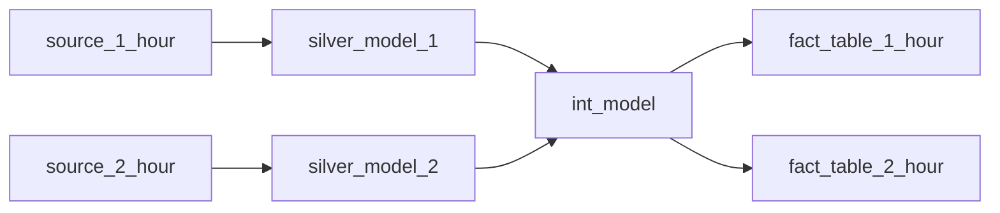
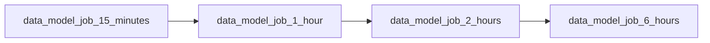
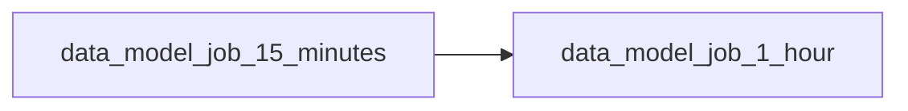

# Intro
This document describes the proposed solution for multi-frequency data processing in dbt and justifies design decisions.
This is meant as documentation and as a support for discussions on the best implementation.
**Feedback/Comments requested**

# Goals
- Run some gold/diamond/mlgold dbt models at a sub-daily frequency (every hour, etc).
- Minimize the added cost of higher-frequency data.
- Reuse existing dbt models rather than create dedicated ones for higher-frequency data.
- Make changing the schedule of a dbt model as simple as possible. Do not require the creation of new pipelines.
- Refresh data "as fast as possible".

## Frequency tagging
How do we select a part of the dbt lineage to run at a specific frequency?
The best way we found is to use tags in dbt along with the selector intersection.

**1: Tag dbt sources.**

Add frequency tags to dbt sources. The tags should be consistent with the frequency set in the ingestion config.
Consider which tables contain data that actually changes often and should be ingested frequently.
It's ok to refresh a gold table even if some part of the data isn't up-to-date. Assume that the daily job will rerun everything
with the most up-to-date data available.

```yaml title="transform/silver/operations/_operations__source.yml"
sources:
  - name: operations
    schema: bronze
    description: "Tables from the operations database in the CoreDB Azure SQL Server"
    tables:
      - name: operations__case_category
      - name: operations__case_cause
      - name: operations__case_line
        tags: ["15_minutes"]
      - name: operations__case_line_type
      - name: operations__case_line_ingredient
        tags: ["15_minutes"]
      - name: operations__case_responsible
      - name: operations__cases
        tags: ["15_minutes"]
```
Note 1: Having to tag the same table in the ingestion and in dbt sources is a bit annoying. Can possibly be automated.
Note 2: The original plan was to tag silver models, but tagging sources is way more convenient and achieves the same thing.
Note 3: Tagging sources also makes it easy to run snapshots at different frequencies.


**2: Tag dbt models at the end of the lineage**

We will also tag dbt models with the frequency that we want them to be refreshed at.
We only tag **leaf nodes**. Models at the end of the lineage (gold/diamond/mlgold) that we want to expose to downstream consumers.
Tagging silver or intermediate models is not necessary.

```yaml title="transform/models/gold/operations/_operations__models.yml"
  - name: fact_cases
    description: >
      Cases and case lines reltated to deliveries reported by the customer, customer service or partners.
      A case line includes communication records (SMS and notes), redelivery events, and complaints with reimbursement options.
      A delivery can only have one related case, but a case can have several case lines.
    latest_version: 1
    meta:
      owners:
        - "Marie Borg"
    config:
      alias: fact_cases
      tags: ["15_minutes"]
      contract:
        enforced: true
```

**3: Use intersection selector to handle everything in-between**

Now that we have tagged the start and the end of the lineage, we can use [dbt's intersection syntax](https://docs.getdbt.com/reference/node-selection/set-operators) to handle everything in-between.

In practice we run something like:
```bash
dbt run -s "tag:2_hours+,+tag:2_hours"
```

Which translates to "Run every model with the 2_hours tag and every model between two nodes with the 2_hours tag in the lineage".

In the example given so far, this will run:
- `fact_cases`
- The silver models depending on the tagged sources (`operations__case_lines`, `operations__case_line_ingredients` & `operations__cases`)
- All the intermediate models downstream of said silver models **AND** upstream of `fact_cases`

This method allows us to skip all the silver / intermediate models which have no new data ingested or aren't necessary for the gold table to be fresh.
This allows us to efficiently run parts of the whole dbt project at different frequencies without having to figure out the schedule of every intermediate model and tag them accordingly, which would be very painful.

## Solving concurrency headaches

dbt offers no guarantee when it comes to safe concurrency. Basically, having two different jobs that run the same dbt model at the same time leads to unpredictable behaviours and should be avoided as much as possible.

This makes our life much more difficult because **some intermediate models may be used in several frequency jobs**. Consider the example below:




The `int_model` will be picked up by both `dbt run -s "tag:1_hours+,+tag:1_hours"` and `dbt run -s "tag:2_hours+,+tag:2_hours"`.
If we simply had 2 separate jobs running these dbt commands every hour and every 2 hours respectively, 
there would be a risk that they both try to run `int_model` at the same time. Leading to the kind of unpredictable concurrency issues that we want to avoid.

The simple way to prevent this issue is to always run the jobs in order from fastest to slowest. For example at 12PM (noon), we would run:


At 11:00AM, we would only run:


**The main downside of this approach is that several jobs may run the same intermediate model**, which would be a waste of resources.
We've considered many options to avoid this, but none of them seemed reliable.

If an intermediate model is slow enough that redundant runs are a big problems, we can optimize that intermediate model by making it incremental etc. or separate the parts of the models that require different frequencies by breaking it down into several smaller models.

**WARNING!** Always have at least 1 day of lookback for incremental intermediate model. If `int_model` in the example above had no lookback period, it would be run by the 1_hour job on stale data (silver_model_2 has not run yet) and the 2_hour job would not correct this because it would find that `int_model` is already up-to-date.


## Running the right jobs in the right order
We want to run the right job at the right time. And we want to make sure that we always run jobs in order from fastest to slowest.
How do we do that?

#### The job setup
We have a controller job `jobs/main_data_model_intraday_scheduler.yml`. The controller job is responsible for running different version of our data model job corresponding to different frequencies: `main_data_model_1_hour.yml`, `main_data_model_2_hours.yml` etc.

Each of these "frequency jobs" will run the ingestion, dbt run and dbt test for the tables/models with the corresponding frequency tags. If another job needs to run at the end of one of the frequency job (e.g: the preselector materialization job that we currently run every 2 hours), we can add it as a run-job task in the appropriate frequency job. 

**Why have several jobs?** We could just as well put everything in the controller job. That would result in less duplication of code. But I think the controller job would end up being very big and annoying to change. Best to keep them separate IMO.

# TODO: FIX THIS --------------------------------------
When it comes to concurrency, the controller job `jobs/main_data_model_intraday_scheduler.yml` is allowed to have multiple runs active at the same time. Running 15_minutes & 1_hour & 2_hour will probably takes longer than 15_minutes and that shouldn't stop the next 15_minutes run from starting. BUT each of the frequency jobs are only allowed to have 1 run active at the same time. 

Note: I also kept the daily job (`main_data_model_job.yml`) completely separated and on its own schedule. The intraday controller job will pause while the daily job is running (we probably don't need to update data often during the night anyways).
I could see going back on that in the future, but keeping these two separated feels a bit more resilient.
# -----------------------------------------------------

#### The controller job

The controller job runs at the highest frequency (currently every 15 minutes). It starts by running a simple python script that will receive the job's start datetime as a parameter. For each frequency, the script will calculate a boolean value indicating whether the corresponding job should run or not. Then sends those values back for the controller job to use.

```python title="useful/schedule_controller.py"
# Databricks notebook source
from datetime import datetime, timezone
from zoneinfo import ZoneInfo

# COMMAND ----------
job_start_datetime_string = dbutils.widgets.get("job_start_datetime")

# Convert job start time from a UTC string to a datetime object with the Oslo timezone
format_string = "%Y-%m-%dT%H:%M:%S.%f"
oslo_tz = ZoneInfo("Europe/Oslo")
job_start_datetime_utc = datetime.strptime(job_start_datetime_string, format_string).replace(tzinfo=timezone.utc)
job_start_datetime_oslo = job_start_datetime_utc.astimezone(oslo_tz)

# Decides which frequencies should be run based on the job start time
daily_run_start_hour = 4
is_15_minutes = True  # fastest schedule always run
is_1_hour = job_start_datetime_oslo.minute < 15  # Run on the first trigger of the hour
is_2_hours = is_1_hour and job_start_datetime_oslo.hour % 2 == 0  # Run every even hour
# Run every 6 hours but skip 6AM run which is redundant with daily run
is_6_hours = is_1_hour and job_start_datetime_oslo.hour in (12, 18, 24)
is_daily = is_1_hour and job_start_datetime_oslo.hour == daily_run_start_hour  # daily run starts at 4AM

# frequency_tag, boolean value
schedules = [
    ("15_minutes", is_15_minutes),
    ("1_hour", is_1_hour),
    ("2_hours", is_2_hours),
    ("6_hours", is_6_hours),
    ("daily", is_daily),
]

# Export ~boolean values indicating which jobs to run
for tag, value in schedules:
    dbutils.jobs.taskValues.set(key=f"is_{tag}", value=str(value).lower())
```

The controller job will then run the different frequency jobs in order from fastest to slowest. But before each frequency job, we add a condition_task that checks the boolean values exported by schedule_controller to decide whether the next job should run.


```yaml title="jobs/main_data_model_intraday_scheduler.yml"
# the highest frequency job always run. No need for a conditional task here
- task_key: schedule_controller
    description: Decide whether each frequency job should run
    depends_on:
    - task_key: check-if-main-data-model-job-runs
    notebook_task:
    notebook_path: ../useful/schedule_controller.py
    base_parameters:
        # pass the start time of the job to the python script
        job_start_datetime: "{{job.start_time.iso_datetime}}"

- task_key: main_data_model_15_min
    depends_on:
    - task_key: schedule_controller
    run_job_task:
    job_id: ${resources.jobs.data_model_job_15_minutes.id}

- task_key: is_1_hour
    depends_on:
    - task_key: main_data_model_15_min
    run_if: ALL_DONE
    condition_task:
    op: EQUAL_TO
    # these are the boolean values exported by the schedule_controller task
    left: "{{tasks.schedule_controller.values.is_1_hour}}"
    right: "true"

- task_key: main_data_model_1_hour
    depends_on:
    - task_key: is_1_hour
        outcome: "true"
    run_job_task:
    job_id: ${resources.jobs.data_model_job_1_hour.id}
```

Note that each frequency jobs only require the faster job(s) to be done, not successful. So if the 15_minutes job fail, we do not skip every slower job. So a failure in a fast job doesn't take down the whole thing.


## Limitations, warnings and gotchas
I think this is a decent and reliable solution. But dbt does not support this kind of use case very well, so there are some limitations and some less-than-optimal parts.

1. There will be some intermediate models that are run multiple time by different frequency jobs for no good reasons. I don't think there's a way around it that isn't either unreliable or very tedious. If redundant runs are too bad for runtime, we can optimize the models or break them down into smaller models that belong more neatly to only one frequency job.

2. Suboptimal ordering. The order of the job is static, so the first 15_minutes run of the hour will not have access to the hourly data, even if it could use it. It's not impossible to adjust the timing dynamically, but then the runtime of the faster jobs become unpredictible and they risk timing out. 